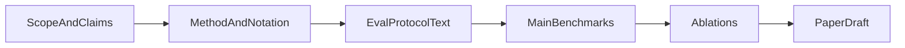

# CoPE-VGAE 論文執筆・再現までのワークフロー

本ドキュメントは、実装（`pnode_patent_runner`）と論文本文の記述を一致させ、査読で突かれやすい点（評価プロトコル・公平性・限界）を先に潰すための **手順書** です。技術仕様の詳細は [README_COPE.md](README_COPE.md) を一次情報とし、ここでは **執筆フェーズとスクリプト対応**を中心に書きます。

---

## フェーズの流れ（概要）



---

## 0. スコープと貢献の固定（最初に1ページ）

論文の残りの構成を決める前に、次を文章で固定する。

| 項目 | 記入のポイント |
|------|----------------|
| **問題** | 年次二部グラフ上の **future-link 予測**（左＝企業または著者、右＝特許・論文・トピック等）。 |
| **提案** | **同一 `PotentialNet` の $\Phi$** が (1) 勾配流 ODE の速度場 $-\nabla\Phi$ と (2) デコーダの $w_{\mathrm{pot}}(\Phi_i+\Phi_j)$ の両方に現れる（`UnifiedVGAE`）。 |
| **対照** | `BenchmarkTemporalVGAE` の **P-NODE** は同様の勾配流だが **デコーダに $\Phi$ を入れない**。Static / RNN / Neural ODE との違いは [README_COPE.md のベースライン表](README_COPE.md) 参照。 |
| **主な評価指標** | 検証は **`evaluate_val_future_link_metrics`** に基づく **ROC-AUC**、**AP**、**ECE**（リンク logit の sigmoid 上の等幅ビン期待較正誤差; `FUTURE_LINK_ECE_N_BINS`）。対象は時系列の **最終2年** $y_{T-1}\to y_T$ の future-link（実装: `unified_training.py`）。 |
| **データドメイン** | `--data-domain patent` / `arxiv` / `author_topic` のいずれを主結果にするか。 |

---

## 1. 手法（Method）の執筆と実装の対応

| 論文に書く内容 | 実装・ドキュメント |
|----------------|-------------------|
| エンコーダ（GAT）・VAE の再パラメータ化 | `SharedVGAEEncoder`（`models.py`）、`UnifiedVGAE.encode`（`unified_vgae.py`） |
| $\Phi$ と ODE | `PotentialNet`、`GradientODEFunc`、`GradientNeuralODEPredictor`（`models.py`） |
| デコーダ logit（distance / cosine + $\Phi$ 項） | `UnifiedVGAE.decode_logits`（`unified_vgae.py`） |
| 損失の合成（6成分） | `compute_loss_standardized`（`unified_training.py`）、係数は [README_COPE.md「損失関数」](README_COPE.md) |
| ベースラインの差分 | `BenchmarkTemporalVGAE`（`benchmark_vgae.py`）、`cope_experiment.BASELINE_METHOD_SPECS` |

**デコーダの数式（論文用の骨子）**

- 共通: $\ell_{ij}^{\Phi} = w_{\mathrm{pot}}\bigl(\Phi(z_i)+\Phi(z_j)\bigr)$
- `distance`: $\mathrm{logit}_{ij} = r - \|z_i-z_j\|^2 + \ell_{ij}^{\Phi}$（実装では logit をクリップ後に sigmoid）
- `cosine`: L2 正規化した $z$ の内積にスケールを掛けた項 $+\ \ell_{ij}^{\Phi}$

`link_score_mode` は **`distance` と `cosine` のどちらを採用したか**を本文・実験設定で明示する。

---

## 2. 評価プロトコル（方法節に必ず書くチェックリスト）

実装は `unified_training.future_link_auc_scores` および `evaluate_val_future_link_metrics`。

| チェック項目 | 内容 |
|--------------|------|
| 時点 | グラフの年を昇順に並べたとき **最後の2年** $(y_{T-1}, y_T)$ について、$y_{T-1}$ 側の情報から $y_T$ のエッジを予測する設定であること。 |
| 正例 | $y_T$ の二部エッジから **最大 1500** 本をサブサンプル（`max_pos`）。 |
| 負例 | 上記正例に現れる active 左ノード・右ノードからランダムにペアを生成。**全候補ペア上の指標ではない**ことを明記。 |
| RNG | 負例サンプルは **固定シード**の NumPy RNG（実装参照）。再現手順にシードを書く。 |
| 指標 | **ROC-AUC** に加え **AP** と **ECE**（`evaluate_val_future_link_metrics` の `ece`；JSON では `final_val_ece` 等）を報告可能。不均衡リンクでは AP が PR の要約として説明しやすい。 |
| 「accuracy」 | リンク予測では **誤解を避け、指標名（AUC/AP）を明示**する。 |

**リークではないことの説明**: $\Phi$ はラベル直入力ではなく、`PotentialNet(z)$ から計算される学習可能な場であること、評価時は `predict_future` 後の $z$ でデコードすること、を必要なら一文で書く。

### ホールドアウト（1+2+5: 最終テスト年を学習に含めない）

[`run_benchmark_comparison.py`](run_benchmark_comparison.py) と [`run_optuna_unified_vgae.py`](run_optuna_unified_vgae.py) に **`--holdout-test-year Y`** を付けると次のとおりになる（実装: `split_bundle_holdout_test_year`, `hist_edges_union_from_graphs`）。

| 項目 | 内容 |
|------|------|
| 学習に使う年 | `y < Y` のみ。`Y` 年のエッジは **future_link 損失に出てこない**。 |
| `hist_edges` | バンドル全体ではなく、**学習期間のグラフだけ**から和集合を再計算（テスト年のペアを負例制約に先取りしない）。 |
| テスト遷移 | 時系列キー上で `Y` の直前の年 `year_prev` から `Y` への future-link AUC/AP。 |
| 報告 | `final_val_auc` / `final_val_ap` / `final_val_ece` は **ホールドアウト**の指標。学習区間の最後2年は `train_split_val_*` として別記。 |
| 前提 | `--year-range`（または同等の年指定）に **Y が含まれる**こと。 |
| **ドメイン** | **特許・著者–論文・著者–トピックで同一**。`--data-domain` を変えても `split_bundle_holdout_test_year` の挙動は同じ（年次二部グラフのキーが年であることのみ必要）。 |

Optuna の目的関数は **学習グラフのみ**で計算される `best_val_auc`（各 trial でテスト年は学習に未使用）。

**推奨**: 主表をドメイン横断で比較する場合は、**3ドメインすべて**で同様に `--holdout-test-year` を指定し、報告は `final_val_*`（ホールドアウト）を揃える。

**本文主表の固定（査読用）**: **本文の主表はホールドアウト（`--holdout-test-year`）の `final_val_auc` / `final_val_ap` / `final_val_ece` のみ**とする。**Transductive（ホールドアウトなし）の同名列は Appendix（補足実験・感度）に回し、本文の主表・主張と混在させない**（詳細は [docs/TREND_PREDICTION_EXPERIMENT.md](docs/TREND_PREDICTION_EXPERIMENT.md) の「データ分割」）。

### 論文 Experimental setup にそのまま写せる対応表（評価・ホールドアウト・HPO）

査読用に **方法節・実験設定**へ転記する際は、下表をそのまま骨子にできる（詳細は上のチェックリストとセクション5）。

| 論文で宣言する内容 | 実装・フラグ | メモ |
|--------------------|--------------|------|
| 予測タスク | 年次二部グラフの **future-link**（$y_{T-1}$ から $y_T$ のエッジ） | `evaluate_val_future_link_metrics` / `future_link_auc_scores` |
| 検証の時点 | 系列を昇順に並べた **最後の2年**のみ | 中間年の遷移は主指標に含めない |
| 正例 | $y_T$ のエッジから **最大 1500** 本 | `max_pos` |
| 負例 | 正例に現れる active 左右ノードから **ランダム**（全ペアではない） | 再現のため **RNG シード**を論文に記載 |
| 指標 | **ROC-AUC**・**AP**・**ECE**（リンク予測では「accuracy」と書かず指標名を明示） | 不均衡向きに AP を併記；校正は ECE |
| ホールドアウトを使う場合 | `--holdout-test-year Y` | 学習は $y<Y$ のみ；`hist_edges` は学習期間のみで再計算 |
| 多ホライズン（任意） | `--eval-horizon-gaps 1,2,3` | JSON の **`final_metrics_by_horizon_gap`**（`"k"`: auc/ap/ece）— `sorted(years)` 上のインデックス差 $k$ |
| 主表に載せる数値（ホールドアウト時） | JSON の **`final_val_auc` / `final_val_ap` / `final_val_ece`** | テスト遷移 $(Y\text{の直前}\to Y)$ |
| 学習区内の最後2年だけの指標 | **`train_split_val_auc` / `train_split_val_ap` / `train_split_val_ece`**（名前は実装の JSON キーに合わせる） | ホールドアウト有無で意味が変わるため **どちらを主表にしたか**を本文で固定 |
| Optuna の目的 | テスト年 $Y$ は **trial の目的関数に入れない**（`best_val_auc` は学習グラフ上） | `--holdout-test-year` 使用時と整合 |
| HPO の書き方（どちらかを明示） | **A**: `--optuna-best-json` は **CoPE のみ**、他は CLI 固定／**B**: 各 `--method` で同じ `--n-trials` の Optuna → `--optuna-best-json-map` | B を主表に推奨する場合はセクション5の対称 HPO を参照 |

**再現用に必ず併記する CLI 情報**（セクション3末と同じセット）: データ CSV パス、`--data-domain`、`--year-range` / `--arxiv-year-min|max`、`--min-patents`、`--epochs`、`--seed`、`--cope-link-score`、使用した場合は `--holdout-test-year` と HPO の **trial 数・探索空間**（`--space`）。

---

## 3. 主実験（ベースライン比較）

**スクリプト**: [`run_benchmark_comparison.py`](run_benchmark_comparison.py)

- 同一データ・同一損失枠で **Static / RNN / Neural ODE / P-NODE / CoPE** を学習し、JSON に結果を保存可能。
- **複数シードの集約（平均・SE・ペア Wilcoxon）**: [`aggregate_benchmark_seeds.py`](aggregate_benchmark_seeds.py) と [docs/STATS_PREREGISTRATION.md](docs/STATS_PREREGISTRATION.md)。**多ホライズン（長期）の事前登録と `--horizon-gap` 集約**: [docs/LONG_HORIZON_PREREGISTRATION.md](docs/LONG_HORIZON_PREREGISTRATION.md)。**コミュニティ実装ベースラインの載せ方**: [docs/EXTERNAL_BASELINE_PLAN.md](docs/EXTERNAL_BASELINE_PLAN.md)。
- **重要**: `--cope-link-score`（`distance` または `cosine`）は **学習・チェックポイント・可視化**と一致させる（[README_COPE.md](README_COPE.md) の注意どおり）。
- **時間依存ポテンシャル**: `--time-dependent-potential` を付けると、**CoPE** は `UnifiedVGAETD`（Φ(z, year)）、**P-NODE** は時間に依存する勾配流 ODE（`GradientNeuralODEPredictorTime`）で学習する。**Static / RNN+VGAE / Neural ODE** は従来どおり潜在ダイナミクスに **スカラーポテンシャル Φ(z) は用いない**ため、時間因子の主効果は **ポテンシャル勾配を含む手法（P-NODE / CoPE）** に対するアブレーションとして解釈するのが素直である。主表で「時間あり／なし」を並べる場合、Static/RNN/NeuralODE の数値が両条件で同一になるのは仕様上想定内であり、**1 回の学習結果を両パネルに掲載する**か、本文で **Φ の時間依存は P-NODE と CoPE にのみ適用**と明記する。JSON には `time_dependent_potential` と学習グラフに基づく `phi_year_min` / `phi_year_max` が入る。因子実験の一括実行例は [`scripts/run_factorial_benchmark.sh`](scripts/run_factorial_benchmark.sh)。

### コマンド例（リポジトリ `kumagai` ルートで実行）

特許（企業–特許）:

```bash
cd /path/to/kumagai

python -m pnode_patent_runner.run_benchmark_comparison \
  --data-domain patent \
  --data notebooks/work/dataset/topic_info3.csv \
  --year-range 2010 2020 \
  --epochs 10 \
  --seed 42 \
  --methods all \
  --cope-link-score distance
```

最終年をホールドアウトテストにする例（`2020` を学習に含めない）:

```bash
python -m pnode_patent_runner.run_benchmark_comparison \
  --data-domain patent \
  --data notebooks/work/dataset/topic_info3.csv \
  --year-range 2010 2020 \
  --holdout-test-year 2020 \
  --epochs 10 \
  --seed 42 \
  --methods all \
  --cope-link-score distance
```

著者–論文（`--data-domain arxiv`）と著者–トピック（`--data-domain author_topic`）も **特許と同じ CLI** で評価する。**ホールドアウトも同じ** — `--holdout-test-year Y` は `patent` / `arxiv` / `author_topic` のいずれでも有効（実装はドメイン非依存）。指標は `final_val_auc` / `final_val_ap` / `final_val_ece`（ホールドアウト時はテスト遷移）、定義は future-link の ROC-AUC / AP / ECE で共通。

**著者–論文（ArXiv 風 CSV）** — 想定列: `description_embedding`, `authors`, `year`, `url` 等。`--data` 省略時はリポジトリ既定パスを探索。学習・可視化と **年の切り方を揃える**（`--arxiv-year-min` / `--arxiv-year-max` と `--year-range`）。

```bash
python -m pnode_patent_runner.run_benchmark_comparison \
  --data-domain arxiv \
  --data data/processed/arxiv_cs_embedded_2020-2026_full.csv \
  --arxiv-year-min 2020 --arxiv-year-max 2026 \
  --year-range 2020 2024 \
  --min-patents 5 \
  --epochs 10 \
  --seed 42 \
  --methods all \
  --cope-link-score cosine
```

**著者–トピック** — 同じ ArXiv 埋め込み CSV を使い、**`topic` 列**が必須（列名変更は `--topic-column`）。右側はトピックノード。

```bash
python -m pnode_patent_runner.run_benchmark_comparison \
  --data-domain author_topic \
  --data data/processed/arxiv_cs_embedded_2020-2026_full.csv \
  --arxiv-year-min 2020 --arxiv-year-max 2026 \
  --year-range 2020 2024 \
  --min-patents 5 \
  --epochs 10 \
  --seed 42 \
  --methods all \
  --cope-link-score cosine
```

査読用の **主張・記号・消融 A1–A5・否定結果スケジュール**の一枚物: [docs/PNODE_PAPER_FRAMING.md](docs/PNODE_PAPER_FRAMING.md)。  
**技術トレンド予測の性能比較**（目的・分割・ハイパラ・評価・可視化・再現性のテンプレ）: [docs/TREND_PREDICTION_EXPERIMENT.md](docs/TREND_PREDICTION_EXPERIMENT.md)。

著者系で **ホールドアウト**する例（最終年 `2024` をテストに回す）:

```bash
python -m pnode_patent_runner.run_benchmark_comparison \
  --data-domain arxiv \
  --data data/processed/arxiv_cs_embedded_2020-2026_full.csv \
  --arxiv-year-min 2020 --arxiv-year-max 2026 \
  --year-range 2020 2024 \
  --holdout-test-year 2024 \
  --min-patents 5 --epochs 10 --seed 42 --methods all
```

（`author_topic` でも同様に `--holdout-test-year` を付けられる。）

**主表の書き方（例）**: 行＝ドメイン（企業–特許 / 著者–論文 / 著者–トピック）、列＝手法 × AUC（± 標準偏差）× AP × ECE。データが揃わない場合は脚注で CSV・年範囲を記載。

出力の既定: `pnode_patent_runner/outputs/cope_benchmark/benchmark_<data_domain>_seed<seed>.json`（`data_domain` は `patent` / `arxiv` / `author_topic`）。

**論文に書くこと**: CSV パス、`--year-range` / `--arxiv-year-*` / `--min-patents`、`--epochs`、`--seed`、`--cope-link-score`、ECE のビン数（JSON の `future_link_ece_n_bins`）、デバイス（CPU/GPU）。

---

## 4. 消融（Ablation）

| 目的 | スクリプト・内容 |
|------|------------------|
| **A1–A5**（$w_{\mathrm{pot}}$・$L_{\mathrm{pot}}$・$L_{\mathrm{traj}}$・時間静的対照・負例数）の実装対応と再現コマンド | [docs/PNODE_PAPER_FRAMING.md](docs/PNODE_PAPER_FRAMING.md) セクション 5–6 |
| CoPE の **補助損失**（潜在予測・未来リンク・$L_{\mathrm{pot}}$・軌道）を切った場合 | [`run_cope_effectiveness.py`](run_cope_effectiveness.py) — `mode=both` で **cope** と **ablation（補助重み0）** を比較（特許パイプラインのみ）。 |
| **P-NODE vs CoPE**（デコーダに $\Phi$ なし / あり） | `run_benchmark_comparison` の `pnode` と `cope` の列の差として主表に含める。 |

### 消融の整理表（$\Phi$ の役割と補助損失）

| 比較 | 何が違うか | スクリプト・出力の見方 |
|------|------------|------------------------|
| **P-NODE vs CoPE** | 時間発展はどちらも勾配流だが、**リンク logit に $w_{\mathrm{pot}}(\Phi_i+\Phi_j)$ を足すか否か**（同一 `PotentialNet` の $\Phi$ をデコーダで共有するのが CoPE） | [`run_benchmark_comparison.py`](run_benchmark_comparison.py) の JSON で **`pnode`** と **`cope`** の列を並べる |
| **CoPE（full）vs ablation** | ablation は **潜在予測・未来リンク・$L_{\mathrm{pot}}$・軌道**の重みを **0**（再構成＋KL 中心）。`cope` は README の既定重みで6成分 | [`run_cope_effectiveness.py`](run_cope_effectiveness.py) の `mode=both` が **同条件で2回学習**し future-link AUC を比較（**企業–特許データのみ**） |

論文の表では、上の **行1** を主表または「デコーダでの $\Phi$」の小節に、**行2** を補助損失の消融表に配置すると、貢献（幾何項＋$\Phi$ 項の一貫性 vs 補助項の効果）が読み分けやすい。

例（特許・既定 CSV）:

```bash
python -m pnode_patent_runner.run_cope_effectiveness \
  --data notebooks/work/dataset/topic_info3.csv \
  --year-range 2010 2020 \
  --epochs 10 \
  --seed 42 \
  --mode both \
  --cope-link-score distance
```

---

## 5. ハイパラ調整（Optuna と公平性の書き方）

**スクリプト**: [`run_optuna_unified_vgae.py`](run_optuna_unified_vgae.py) → [`run_benchmark_comparison.py`](run_benchmark_comparison.py)

| 手順 | 内容 |
|------|------|
| **同一検証 split** | Optuna もベンチマークも **同じ CSV・同じ `--year-range` / `--holdout-test-year`**。テスト年は trial の目的関数に入れない（実装どおり）。 |
| **同一探索予算** | 各手法で `run_optuna_unified_vgae` に **`--method static` 等**と **同じ `--n-trials`**（および必要なら同じ `--epochs`）を指定し、**別 study / 別出力 JSON** を得る。 |
| **ベンチマークへの流し込み** | `--optuna-best-json-map` に **手法キー → 各 `best_params_*.json` のパス** を書いた JSON を渡すと、`static` / `rnn` / … それぞれに対応する `best_params` が適用される。 |
| **省略時（従来）** | `--optuna-best-json` は **cope 専用**（1 ファイルだけ渡す）。他手法は CLI の損失・学習率のまま。 |

### 対称 HPO（主表・手法間公平）の手順

主表で **Static / RNN / Neural ODE / P-NODE / CoPE** を同じ探索予算で並べる場合の推奨フロー。

1. **同一データ条件**で、各手法ごとに `run_optuna_unified_vgae` を実行する（**同じ** `--n-trials`・`--epochs`・`--year-range` / `--holdout-test-year`・`--cope-link-score`・`--seed`）。`--method` は `cope` / `static` / `rnn` / `neural_ode` / `pnode` を順に指定し、**出力は手法別 JSON**（例: `best_params_cope.json` …）。
2. 手法キー → JSON パスのマップを1つ作り、`run_benchmark_comparison` に **`--optuna-best-json-map`** で渡す（`--optuna-best-json` の cope 専用モードは使わない）。
3. ホールドアウトを論文主表に使うなら、Optuna とベンチマークの **両方**に同じ `--holdout-test-year` を付ける。
4. 論文には **trial 数**（例: 30）、**探索空間**（`--space default|minimal|wide`）、study の再現用に **シードと DB パス**（任意）を記載する。

**一括実行の雛形（上記 1–2 を自動化）**: [`pnode_patent_runner/scripts/run_symmetric_hpo_benchmark.example.sh`](scripts/run_symmetric_hpo_benchmark.example.sh) — 各 `--method` で同じ `N_TRIALS` の Optuna のあと、`optuna_paths_by_method.json` を生成して `--optuna-best-json-map` 付きで `run_benchmark_comparison` を呼ぶ（リポジトリ **kumagai ルート**で実行）。

```bash
chmod +x pnode_patent_runner/scripts/run_symmetric_hpo_benchmark.example.sh
./pnode_patent_runner/scripts/run_symmetric_hpo_benchmark.example.sh
# スモーク: SMOKE=1 ./pnode_patent_runner/scripts/run_symmetric_hpo_benchmark.example.sh
# 本番例: N_TRIALS=30 HOLDOUT_TEST_YEAR=2020 ./pnode_patent_runner/scripts/run_symmetric_hpo_benchmark.example.sh
```

**最短パイプライン確認**は `SMOKE=1`、**速いプロトタイプ（対称のまま軽量化）**は `PROTOTYPE=1`（既定で trial 5・epoch 3・`--space minimal`）、**本番の主表**は `SMOKE`/`PROTOTYPE` なしで `N_TRIALS=30` 等を指定。

論文では、上記のどちらのプロトコルか（CoPE のみ HPO か、主要ベースラインも同予算か）を **明示**し、採用しなかった側の解釈上の限界も短く書くとよい。

---

## 6. 図表の推奨順序

1. **アーキテクチャ図**: Encoder → $\Phi$ / $-\nabla\Phi$ ODE → デコーダ（幾何項 + $\Phi$ 項）。P-NODE との差は **デコーダに $\Phi$ を足すか否か**。
2. **主結果表**: ドメイン × 手法 × AUC（± 標準偏差が望ましい）× AP × ECE。
3. **消融表 / 補足**: `run_cope_effectiveness` または $w_{\mathrm{pot}}=0$ の議論。
4. **可視化**（任意・**解釈用**）: $\Phi$ ヒートマップ・勾配場。企業–特許向け CLI は [`run_interactive_landscape_cope_vector_field.py`](run_interactive_landscape_cope_vector_field.py)。**既定テンプレート**は [`interactive_vector_field_alt_dark.html`](interactive_vector_field_alt_dark.html)（ダーク左パネル・Viridis 系の **map_cope_alt_dark スタイル**）。既定出力は `pnode_patent_runner/outputs/cope_landscape/map_cope_alt_dark.html`。

### 2D 潜在マップと主表の数値を対応づける（必須の注意）

インタラクティブ地図は **`latent_dim=2`** で学習したチェックポイント向けであり、**主表の future-link AUC/AP（多くは高次元 `latent_dim`）とは別実験**になりうる。論文では次のいずれかを必ず明記する。

- **（推奨）** 図のキャプションに **「解釈用（`latent_dim=2`）」** と書き、主表は **高次元潜在**での結果であることを一文で区別する。
- または、主表と**同一条件**（`latent_dim`・`--seed`・CSV・年範囲・`--cope-link-score`・`--min-patents`）で 2D 学習した `.pt` を用いたことを **表または脚注**で示す。

| 主表・再現と揃える項目 | 地図 CLI で一致させるフラグ |
|--------------------------|-----------------------------|
| 乱数再現 | 同じ `--seed` |
| デコーダ形状 | 同じ `--cope-link-score`（および cosine 時はスケール系ハイパラ） |
| グラフ定義 | 同じ `--data`・`--year-range`・`--min-patents`（著者系は `--arxiv-year-min|max`） |
| 潜在次元 | 地図用は **`latent_dim=2`** のため、主表と異なる場合はキャプションで宣言 |
| 読み込み重み | [`run_interactive_landscape_cope_vector_field.py`](run_interactive_landscape_cope_vector_field.py) の `--load-checkpoint` が **その条件で学習した** `.pt` であること |

詳細は [README_COPE.md](README_COPE.md) の「チェックポイントとデータの整合」も参照。

---

## 7. 限界・データ・倫理（短くてよい）

- 評価が **サブサンプル上の AUC/AP** であること、**最終2年**に限定していること。
- データの出所・ライセンス・匿名化の有無。
- 2D 潜在の地図は **解釈用**であり、報告する主表の AUC/AP が **同じ `latent_dim`・同一学習条件で得たものか**を明示する（セクション6の表）。

---

## 8. 執筆の順序（おすすめ）

1. **Method**（実装と数式の突き合わせ）
2. **Experimental setup**（データ、ハイパラ、シード、CLI）
3. **Results**（表・図）
4. **Related work**（位置づけが固まってから）
5. **Introduction / Conclusion**（貢献の一文と整合）

---

## 再現用の多シード・多ドメイン実行

雛形: [`pnode_patent_runner/scripts/paper_benchmark_suite.example.sh`](scripts/paper_benchmark_suite.example.sh)  
（パスと年範囲を環境に合わせて編集すること。）

---

## 今後の拡張（本リポジトリのスコープ外の例）

- 全ペア評価、Hits@K / MRR、複数年先の汎化、追加ベースラインなどは、必要に応じて別実装・別節として論文に記載できる。
