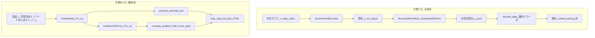
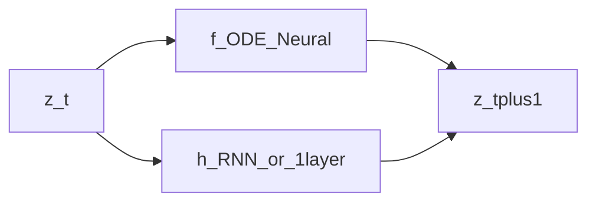

# 精度最大化 × ポテンシャル・ベクトル場可視化 — 設計の確定メモ

本書はプラン「精度とポテンシャル可視化」の **意思決定と実装接続**をリポジトリに固定するためのものです（プラン `.md` 本体は変更しない）。

---

## 0. 固定制約: **VGAE ＋ Neural ODE**

本プロジェクトでは **時系列の主モデルは VGAE（`SharedVGAEEncoder`）＋ Neural ODE（素のベクトル場 ODE）** とする。リポジトリでは [`BenchmarkTemporalVGAE`](benchmark_vgae.py) の **`variant="neural_ode"`**（[`NeuralODEPredictor`](models.py) / `StandardODEFunc`）がこれに相当する。

| 含む | 含まない（主表の「予測本体」としては使わない） |
|------|-----------------------------------------------|
| GAT-VGAE エンコーダ + 再パラメータ化潜在 | RNN+VGAE を **主張の核とする**主表構成 |
| `NeuralODEPredictor`（ポテンシャル勾配ではない ODE） | P-NODE / CoPE の **勾配流**（別枠で比較対象にできる） |

**精度最大化との関係**: ベンチマーク上は RNN が強いことがあるが、制約下では **Neural ODE 側の表現力・学習安定化・HPO**（[`run_benchmark_comparison`](../run_benchmark_comparison.py)、[`--optuna-best-json-map`](../PAPER_WORKFLOW.md)）で埋める。案 **B/C**（時間条件付き Φ や残差場）は **同一 VGAE バックボーンのまま** ODE 部分を拡張する方向が整合しやすい。

**可視化**: ポテンシャル曲面・`−∇Φ` の map（`map_cope_alt_dark` 系）は、制約上 **別モジュールの Φ_vis**（案 A）または **学習後フィット**（案 D、潜在は Neural ODE VGAE から取得）で与えるのが素直である。**Neural ODE のベクトル場そのものは一般にスカラーポテンシャルの勾配ではない**ため、図の Φ は「解釈用のエネルギー」として定義し、本文で式を固定する。

---

## 1. To-do: 予測と Φ 可視化 — **共有か分離か（決定）**

### 結論（推奨デフォルト）— **制約 0 を満たす場合**

| 優先目的 | 推奨 | 理由 |
|----------|------|------|
| **主表の AUC/AP を、VGAE＋Neural ODE の範囲で最大化** | **分離（案 A に近い形）** | 予測は [`BenchmarkTemporalVGAE`](benchmark_vgae.py) **`neural_ode`**（＋必要ならデコーダ・損失の拡張）に集中し、**スカラー Φ_vis は解釈・図用**として別モジュール化する。リンク損失と「盆地の見え方」の目的が競合しにくい。 |
| **単一ネットで力学と数値を一本化** | **共有（案 B/C）** | `Φ(z,τ)` や `v=−∇Φ+h` を **同一潜在空間**で学習する。実装・消融コストは高いが、RNN を主表に置けない制約下ではここで表現力を稼ぐ選択肢になる。 |

**採用ルール（推奨）**

1. **第1段**: 分離案で主表を固める（**予測本体 = VGAE＋Neural ODE**、Φ_vis は HTML 用）。
2. **第2段（任意）**: 共有案（案 B/C）で ODE＋ポテンシャル系を統合試験する。

---

## 2. To-do: 案 A/B/C/D の位置づけ — **主表と図の役割（決定）**

| 案 | 主表（数値） | 図（map_cope_alt_dark 系） | 論文での書き方 |
|----|----------------|---------------------------|----------------|
| **A** | **VGAE＋Neural ODE** で精度最大化（`neural_ode`） | **Φ_vis** 専用（`GradientODEFunc` 互換）から `−∇Φ`・ヒート | 「主結果は Neural ODE VGAE」「図の Φ は解釈用」と **明示** |
| **B** | 同一枠で **Φ(z,τ)**＋ODE 系を検討（実装コスト高） | 年 τ ごとに Φ(z,τ) のグリッド | Method で **τ** と「各年の保守場」を定義 |
| **C** | **v = −∇Φ + h(z,hist)**（h で系列補正、バックボーンは VGAE） | **図は −∇Φ 成分のみ** | キャプションで矢印の定義を **固定** |
| **D** | **VGAE＋Neural ODE** で学習 → 潜在軌道に Φ を事後フィット | フィットした Φ のみ | 「可視化は補助」「主表は Neural ODE」と **明示** |

**推奨パッケージ（制約 0 下）**

- **本文主軸**: **A**（Neural ODE が主表、Φ は図用）。
- **付録**: **D**（同一 Neural ODE VGAE の z に対する事後 Φ）。
- **将来拡張**: **B** または **C**（単一モデル物語・表現力強化）。

### 論文アウトライン対応（コピー用）

- **Experimental results**: 表は `run_benchmark_comparison` + 公平 HPO（[`PAPER_WORKFLOW.md`](../PAPER_WORKFLOW.md)）。
- **Qualitative / Interpretation**: `map_cope_alt_dark` 相当の図は **Φ の定義**を Method または図注で一言に固定（案 A なら Φ_vis、案 C なら保守場成分のみ）。

---

## 3. To-do: `interactive_landscape_vector_field` 互換 — **インターフェース方針（決定）**

現行の [`compute_vector_field_for_plotly`](interactive_landscape_vector_field.py) は次を前提にしている。

```text
pot = model.temporal_predictor.potential_net   # compute_potential_grid を持つ
ode_f = model.temporal_predictor.ode_func      # compute_gradient_field(X,Y) を持つ
```

### 方針 A（最小変更・推奨）— **VGAE＋Neural ODE ＋ Φ_vis**

主モデルは **`BenchmarkTemporalVGAE`（`neural_ode`）** のまま学習する。HTML 用に **別インスタンス**（またはラッパ）で次を満たす。

- `potential_net`（= Φ_vis）: `forward(z) -> (N,1)`、`compute_potential_grid(...)`。
- `ode_func`: [`GradientODEFunc`](models.py)(Φ_vis) で `compute_gradient_field` が使えること。

**実装パターン**: 学習済み Neural ODE VGAE から **エンコード z を書き出し**、Φ_vis だけを補助損失で学習してから `compute_vector_field_for_plotly` に渡すラッパモデルを用意する。または **同一 `nn.Module` に `temporal_predictor_neural`（本番）と `temporal_predictor_vis`（Φ_vis 用 `GradientNeuralODEPredictor`）を併設**し、ベンチは前者、HTML は後者を参照する。

### 方針 B（拡張）

[`compute_vector_field_for_plotly`](interactive_landscape_vector_field.py) に **オプション引数**を追加する案（将来実装）:

- `potential_module: Optional[nn.Module] = None`
- `ode_gradient_module: Optional[nn.Module] = None`

省略時は現行どおり `model.temporal_predictor` を参照。**注入時は Neural ODE の `StandardODEFunc` とは独立に Φ_vis を渡す**（制約 0 下では「予測用 ODE」と「図用ポテンシャル勾配」を分離できる）。

### チェックリスト（図を生成する前）

- [ ] Φ の定義（学習可能か、事後フィットか）を論文と一致させたか。
- [ ] `latent_dim=2`・シード・CSV・年範囲が主表と揃うか（[`PAPER_WORKFLOW.md`](../PAPER_WORKFLOW.md) の注意）。
- [ ] 案 C を使う場合、矢印が **全速度場ではなく −∇Φ** であることをキャプションに書いたか。

---

## 4. 提案アーキテクチャ設計

制約 **§0（VGAE＋Neural ODE）** と、主表と図の **分離（案 A 推奨）** を前提にした構成である。共有型（案 B/C）は §4.5 で拡張として示す。

### 4.1 全体像（案 A：予測パスと可視化パスを分離）



**要点**

- **予測パス**は既存 [`BenchmarkTemporalVGAE`](benchmark_vgae.py)（`variant=neural_ode`）と同一思想：`temporal_predictor` = [`NeuralODEPredictor`](models.py)（`StandardODEFunc`）。時間発展は **スカラーポテンシャルではない**一般ベクトル場。
- **可視化パス**は別モジュール **Φ_vis**（[`PotentialNet`](models.py) ＋ [`GradientODEFunc`](models.py)）で **常に保守場** \( \mathbf{v}_{\mathrm{vis}} = -\nabla_z \Phi_{\mathrm{vis}} \) を定義し、[`interactive_landscape_vector_field.compute_vector_field_for_plotly`](interactive_landscape_vector_field.py) が要求する `potential_net` / `ode_func.compute_gradient_field` を満たす。
- 両パスは **潜在空間の次元・ノード対応**を揃える（同一データ・同一 `latent_dim` で z を取得）。

### 4.2 コンポーネント一覧

| 役割 | 実装の置き場（現状リポジトリ） | 入出力の要約 |
|------|-------------------------------|--------------|
| 左ノード埋め込み・特徴 | `corp_embeddings` + `get_node_features` | ノード特徴行列 |
| 年次エンコード | `SharedVGAEEncoder` | `(mu, logvar)` → `z` |
| **時間発展（主表）** | `NeuralODEPredictor` | `z_t → z_{t+1}`（ODE 積分） |
| リンク logit | `decode_logits`（distance / cosine、Φ 項なし） | エッジごとの確率 |
| **Φ_vis（図のみ）** | `PotentialNet` + `GradientNeuralODEPredictor` の **potential_net 部分だけ**を流用、または同等 API のモジュール | `z ↦ Φ_vis(z)`、グリッド上の等高線・勾配 |
| HTML 生成 | `compute_vector_field_for_plotly` | `potential_net`・`ode_func` から Z と矢印データ |

主表用モデルに **`potential_net` が無い**（`NeuralODEPredictor` のみ）場合、可視化用に **ラッパ `nn.Module`** を用意し、`temporal_predictor = GradientNeuralODEPredictor`（Φ_vis 専用）だけを載せた **別チェックポイント**を保存するか、§4.4 の注入 API を実装する。

### 4.3 学習時データフロー（予測）

年次ペア \((G_t, G_{t+1})\) について、実装は既存 [`unified_training.train_one_epoch`](../unified_training.py) と同型。

1. `encode(G_t) → z_t, μ_t, …`
2. 履歴があれば `predict_future([…, z_t]) → z_{t+1}^{\mathrm{pred}}`（**Neural ODE**）
3. 再構成・KL・潜在 MSE・future-link BCE 等（[`compute_loss_standardized`](../unified_training.py)）
4. **Φ_vis を分離している場合**、主損失から Φ_vis は **切り離す**か、オプションで **補助項**（`μ_{t+1} - z_t` と `−∇Φ_vis` の整合など）だけ別_optimizer で回す。

### 4.4 可視化時データフロー（HTML）

1. 学習済み **VGAE＋Neural ODE** で各年 `encode → z`（`latent_dim=2` 推奨）。
2. **Φ_vis** 用サブネット（または事後学習済み `PotentialNet`）を `model_viz.temporal_predictor` に割り当てたラッパを構築。
3. `compute_vector_field_for_plotly(model_viz, …)` でヒートマップ Z とベクトル場（実装は **−∇Φ の方向**を矢印に使用）。
4. テンプレート [`interactive_vector_field_alt_dark.html`](../interactive_vector_field_alt_dark.html) へ JSON 埋め込み。

**ラッパの最小要件**（既存コード互換）:

```text
model_viz.temporal_predictor.potential_net.forward(z)  # scalar energy
model_viz.temporal_predictor.potential_net.compute_potential_grid(...)
model_viz.temporal_predictor.ode_func.compute_gradient_field(X, Y, ...)
```

予測用 `BenchmarkTemporalVGAE(neural_ode)` には `ode_func` が無いため、**可視化専用 `model_viz` は別オブジェクト**になる（§0 の「Neural ODE は一般に勾配場ではない」ことと整合）。

### 4.5 拡張アーキテクチャ（案 B / C・単一モデル）

**案 B（Φ(z, τ)）**: `PotentialNet` の入力を `concat(z, \mathrm{emb}(\tau))` に拡張。`compute_gradient_field` は **τ 固定**で z にのみ勾配。年スライダーごとにグリッドを再計算。

**案 C（ハイブリッド）**: 予測速度を \(\dot z = f_{\mathrm{ODE}}(z) + h(z, z_{t-k:t})\) とする場合、**HTML に載せるのは Φ_vis 由来の −∇Φ のみ**とし、`h` は図から除外。実装は `NeuralODEPredictor` に残差モジュールを追加する形が [`benchmark_vgae`](benchmark_vgae.py) への差分として明確。



---

## 5. 実験条件の固定（最優先チェックリスト）

改善実験の前に、**再現可能な 1 本の「ベースライン条件」**を決め、以降すべての比較で揃える。論文の Experimental setup にそのまま転記できる形でメモする（[`PAPER_WORKFLOW.md`](../PAPER_WORKFLOW.md) セクション2・3 と対応）。

### 5.1 毎回そろえる CLI・データ（コピー用）

| 項目 | 値（埋める） | メモ |
|------|----------------|------|
| データ CSV パス | | 相対パスでも可 |
| `--data-domain` | patent / arxiv / author_topic | |
| `--year-range` または `--years` / `--all-years` | | arxiv/author_topic は `--arxiv-year-min/max` も |
| `--min-patents` | | 左ノードあたり最小件数 |
| `--holdout-test-year` | なし / 年 | 使うなら `final_val_*` の定義を論文に書く |
| `--seed` | | 乱数・負例サンプルに影響 |
| `--epochs` | | |
| `--cope-link-score` | distance / cosine | 学習・チェックポイント・可視化で一致 |
| `--latent-dim` / `--hidden-dim` | | 主表と図で揃える（2D 図なら latent_dim=2） |
| デバイス | cuda / cpu | 再現性の注意があれば脚注 |

### 5.2 ハイパラ探索の方針（どちらかを明示）

| 方針 | やること | 論文に書くこと |
|------|----------|----------------|
| **公平 HPO（推奨）** | 各手法キーごとに同じ `--n-trials` で Optuna → [`--optuna-best-json-map`](../run_benchmark_comparison.py) で `run_benchmark_comparison` | trial 数・探索空間（`--space`）・study 名 |
| **固定ハイパラ** | README 既定または手動で 1 組だけ。全手法で同一の loss 係数・`lr` を使う | 「Optuna 未使用」「係数は表 X」 |

**理由**: 条件がブレると、あとから「何が効いたか」が説明できない。

### 5.3 出力の保存

- [`run_benchmark_comparison`](../run_benchmark_comparison.py) の JSON（`pnode_patent_runner/outputs/cope_benchmark/benchmark_<domain>_seed<seed>.json`）に、上記フラグが含まれることを確認する。
- 日付付きファイル名で複数走らせる場合は、**論文用に採用した run の JSON パス**を README かメモに残す。

### 5.4 最短ワークフロー（ステップ 1〜4・コマンド例）

リポジトリ **ルート**（`kumagai/`）で実行する想定。変数は **§5.1 の表と同一**に揃える。

**共通のプレースホルダ**

```bash
# 例: 特許・固定条件（値は自分の §5.1 に合わせて書き換え）
CSV="notebooks/work/dataset/topic_info3.csv"
YR="2010 2020"
EP=10
SEED=42
LINK=distance   # or cosine
```

---

**1. 条件を固定する**  
§5.1 の表を 1 行メモに書き、**以降 `CSV` / `YR` / `EP` / `SEED` / `LINK` を変えない**。

主表用に公平 HPO する場合（省略可・時間はかかる）:

```bash
# 各手法で同じ n_trials の Optuna を回したあと生成したマップを渡す（詳細は PAPER_WORKFLOW.md）
python -m pnode_patent_runner.run_benchmark_comparison \
  --data-domain patent --data "$CSV" --year-range $YR --min-patents 2 \
  --epochs $EP --seed $SEED --cope-link-score $LINK \
  --methods all --optuna-best-json-map pnode_patent_runner/outputs/optuna/optuna_paths_by_method.example.json
```

固定ハイパラだけのときは `--optuna-*` は付けない。

---

**2. 床取り（P-NODE vs Neural ODE［＋任意で CoPE］）**  
同じ `CSV,YR,EP,SEED,LINK` で **1 コマンド**:

```bash
python -m pnode_patent_runner.run_benchmark_comparison \
  --data-domain patent --data "$CSV" --year-range $YR --min-patents 2 \
  --epochs $EP --seed $SEED --cope-link-score $LINK \
  --methods pnode,neural_ode,cope
```

出力 JSON を確認し、`pnode` と `neural_ode` の `final_val_auc` を比較。

---

**3. 損失の消融（コスパ重視）**

- **CoPE 専用の自動ペア**（特許パイプライン）: [`run_cope_effectiveness.py`](../run_cope_effectiveness.py) で full vs 補助ゼロ。

```bash
python -m pnode_patent_runner.run_cope_effectiveness \
  --data "$CSV" --year-range $YR --min-patents 2 \
  --epochs $EP --seed $SEED --cope-link-score $LINK --mode both
```

- **P-NODE / Neural ODE** でも同じ損失枠を使うため、**重みを 1 つずつ下げる**ときは `run_benchmark_comparison` に `--latent-pred-weight` / `--future-link-weight` / `--potential-weight` / `--trajectory-weight` を指定（例: `potential` だけ切るなら `--potential-weight 0 --trajectory-weight 0` など）。**同じ `--methods`** で何度か回し、JSON を別名保存して比較。

---

**4. Potential／密度（最後）**  
損失の傾向が見えてから。

- CoPE の密度校準: 上記 `run_benchmark_comparison` に `--cope-density-calibrated` を付けて **同条件**で `cope` 列だけ比較。
- P-NODE に密度項を載せる場合は **別実装**が必要なので、まずは §3 の結果を論文化してから着手する。

---

## 6. 関連ドキュメント

- 案1（密度校準）など既存の研究メモ: [`RESEARCH_METHOD_PROPOSALS.md`](RESEARCH_METHOD_PROPOSALS.md)
- ベンチ・HPO: [`PAPER_WORKFLOW.md`](../PAPER_WORKFLOW.md)
