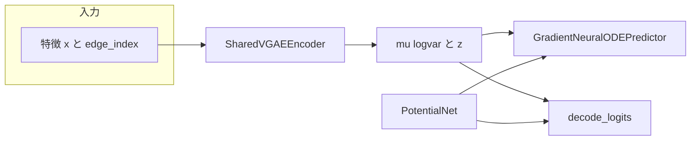
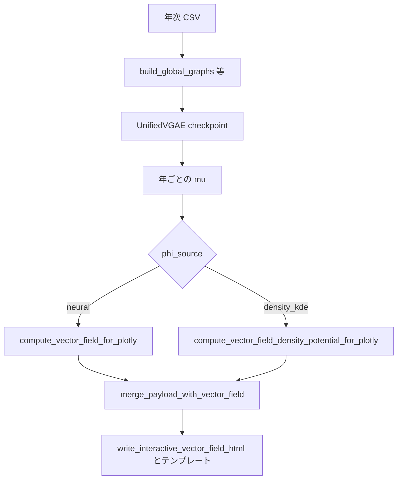

# アーキテクチャ概要（CoPE-VGAE / P-NODE / 密度可視化）

この文書は **モジュール単位の構造とデータの流れ** を一枚にまとめた参照用です。損失の全成分・ハイパラ・ベンチ手順は [README_COPE.md](../README_COPE.md) および [PAPER_WORKFLOW.md](../PAPER_WORKFLOW.md) を参照してください。

| 関連ドキュメント | 内容 |
|------------------|------|
| [README_COPE.md](../README_COPE.md) | 損失 6 成分、データパイプライン、CLI |
| [ACCURACY_POTENTIAL_VIZ_DESIGN.md](ACCURACY_POTENTIAL_VIZ_DESIGN.md) | 精度と可視化の役割分担の論点 |
| [P_NODE_TIME_DENSITY_HOTSPOT.md](P_NODE_TIME_DENSITY_HOTSPOT.md) | 時間つき密度 \(\Phi_t\) の設計案・将来の ODE 組み込み |

**スコープ**: 企業–特許（など）の二部グラフ VGAE、時間予測、リンクデコーダ、潜在次元 2 のときのインタラクティブ地図（Φ ヒート・等高線・\(-\nabla\Phi\) 矢印）。

---

## 1. 学習時のクラス階層

### 1.1 CoPE-VGAE（`UnifiedVGAE`）

実装: [`unified_vgae.py`](../unified_vgae.py)

- **入力特徴**: 特許ノードは CSV 由来の埋め込み、企業ノードは学習可能な `corp_embeddings` で上書き（`get_node_features`）。
- **エンコーダ**: `SharedVGAEEncoder`（GAT 積み上げ）→ 各ノードの `μ`, `log σ²` → 再パラメータ化で `z`。
- **時間予測**: `GradientNeuralODEPredictor` — 内部に `potential_net`（既定は `PotentialNet`）と `GradientODEFunc` があり、`torchdiffeq.odeint` で 1 ステップ先の潜在を返す（[`models.py`](../models.py)）。
- **デコーダ**: `decode_logits` でリンク logit。**`w_pot · (Φ(z_i) + Φ(z_j))`** を幾何項に加算（`link_score_mode` が `distance` / `cosine`）。

### 1.2 P-NODE 対照（`BenchmarkTemporalVGAE`, variant `pnode`）

実装: [`benchmark_vgae.py`](../benchmark_vgae.py)

- `variant == "pnode"` のときも時間予測は **`GradientNeuralODEPredictor`**（同じ勾配流 ODE）。
- **デコーダ**では `decode_logits` に **Φ 項を入れない**（幾何項のみ）。docstring でも「デコーダには Φ を入れない」と明記。
- ベンチでは Static / RNN / Neural ODE など他 `variant` があり、時間予測モジュールだけが入れ替わる（`pnode` のときのみ `GradientNeuralODEPredictor`）。

---

## 2. ODE とポテンシャル \(\Phi\)

### 2.1 勾配流の速度場

`GradientODEFunc`（[`models.py`](../models.py)）は `potential_net(z)` から \(\Phi(z)\) を計算し、`autograd` で \(\nabla_z \Phi\) を得る。ODE の右辺は

\[
\frac{dz}{dt} = -\tanh(\texttt{scale}) \cdot \nabla_z \Phi(z).
\]

`GradientNeuralODEPredictor.forward` は `odeint`（`dopri5`）で \(t \in [0, \Delta t]\) を積分し、終端の \(z\) を返す。

### 2.2 `PotentialNet`（既定）

- 入力 \(z\) を固定乱数基底で射影し、`sin`/`cos` 特徴を MLP に通して **スカラー \(\Phi(z)\)** を出力（`Tanh` 出力層）。
- 2D 可視化用に `compute_potential_grid` で格子上の \(\Phi\) を取得可能。

### 2.3 密度校準ポテンシャル（オプション・学習時）

`UnifiedVGAE` の `density_calibrated_potential=True` のとき、`GradientNeuralODEPredictor` は `CalibratedPotentialNet` を `potential_net` として保持する（[`models.py`](../models.py) の `CalibratedPotentialNet`）。

**合成ポテンシャル**（学習可能な \(w\) は `log_density_weight`）:

\[
\Phi(z) = \varphi_{\mathrm{nn}}(z) - w \cdot \log p_{\mathrm{hist}}(z).
\]

- \(\varphi_{\mathrm{nn}}\) は内部の `PotentialNet`（`nn_pot`）。
- \(\log p_{\mathrm{hist}}(z)\) は **`HistoricalDiagonalLogProb`** の出力（下記 §2.4）。  
- ODE（`GradientODEFunc`）と CoPE の `decode_logits` は、いずれもこの **`potential_net.forward` の \(\Phi\)** を共有する。

各エポックの年次ペア処理の **直前**に、[`train_one_epoch`](../unified_training.py) が `potential_net.update_from_mu(mu_t, active_mask)` を呼ぶ（[`unified_training.py` 304–306 行付近](../unified_training.py)）。`update_from_mu` は **`no_grad`** で、バッチのエンコーダ出力 \(\mu\) から EMA 平均・分散を更新する。**KDE ではない**（scikit-learn の `KernelDensity` によるオフライン KDE とは別物）。

### 2.4 \(\log p_{\mathrm{hist}}\)（対角ガウス・EMA 統計）

`HistoricalDiagonalLogProb`（[`models.py`](../models.py)）は、次元ごとに

\[
\log p_{\mathrm{hist}}(z) = -\frac{1}{2} \sum_{d=1}^{D} \left( \frac{(z_d - m_d)^2}{\sigma_d^2} + \log(2\pi\sigma_d^2) \right),
\]

ここで \(m, \sigma^2\) は **エンコーダの \(\mu\) の移動平均**（`momentum` で更新、`min_var` で下限クリップ）。初回更新前は \(\log p_{\mathrm{hist}} \equiv 0\) を返す。

これは **HTML 用の KDE \(\log \hat p\)** とは定義も推定器も異なる。混同しないこと。

### 2.5 学習時の損失と「密度」の関係（`compute_loss_standardized`）

実装: [`unified_training.py`](../unified_training.py) の `compute_loss_standardized` / `train_one_epoch`。  
重みの既定値・記号の対応は [README_COPE.md](../README_COPE.md)「損失関数」と揃える。

**総損失**（概念）:

\[
\mathcal{L} = \mathcal{L}_{\mathrm{recon}} + \beta \mathcal{L}_{\mathrm{KL}}
+ \lambda_{\mathrm{lat}} \mathcal{L}_{\mathrm{lat}}
+ \lambda_{\mathrm{fut}} \mathcal{L}_{\mathrm{fut}}
+ \lambda_{\mathrm{pot}} \mathcal{L}_{\mathrm{pot}}
+ \lambda_{\mathrm{traj}} \mathcal{L}_{\mathrm{traj}}.
\]

| 項 | 密度・\(\Phi\) との関係 |
|----|-------------------------|
| \(\mathcal{L}_{\mathrm{recon}}\), \(\mathcal{L}_{\mathrm{fut}}\) | CoPE では `decode` が **\(w_{\mathrm{pot}}(\Phi_i+\Phi_j)\)** を含むため、間接的に \(\Phi\)（`PotentialNet` または `CalibratedPotentialNet`）へ勾配が流れる。P-NODE 対照の `BenchmarkTemporalVGAE` ではデコーダに \(\Phi\) なし。 |
| \(\mathcal{L}_{\mathrm{KL}}\) | 標準 ELBO 形（\(\mu,\log\sigma^2\)）。密度項そのものではない。 |
| \(\mathcal{L}_{\mathrm{pot}}\) | `potential_net` ありのとき \(\phi_z = \Phi(z_t)\) に対し **\(\mathcal{L}_{\mathrm{pot}} = 0.01 \cdot \mathrm{mean}(\phi_z^2)\)**（実装上の係数 `0.01` はコード固定）。重みは **`potential_weight` で掛ける**（\(\lambda_{\mathrm{pot}}\)）。 |
| \(\mathcal{L}_{\mathrm{traj}}\) | \(\Phi(z_t)\) から autograd で \(\nabla_z\Phi\)、速度 \(v=-\nabla\Phi\) と教師変位 \(\mu_{t+1}-z_t\) の **コサイン類似度**に基づく `1-\cos` 損失（`trajectory_weight`）。 |

**重要**: **オフライン KDE（§4 の `density_kde`）に対応する損失項は存在しない**。KDE は推論後の可視化のみ。

**密度校準 ON（`CalibratedPotentialNet`）のとき**: \(\mathcal{L}_{\mathrm{pot}}\)・\(\mathcal{L}_{\mathrm{traj}}\)・デコーダ経路で使われる \(\Phi(z)\) はすべて **\(\varphi_{\mathrm{nn}}(z) - w\log p_{\mathrm{hist}}(z)\)**。  
\(\log p_{\mathrm{hist}}\) は \(z\) に依存して微分可能だが、**EMA バッファの更新**（`update_from_mu`）は勾配の対象外。

---

## 3. デコーダ（リンク logit）

エッジ \((i,j)\) について。`\tilde{z}` は L2 正規化、`s` は `cosine_logit_scale`、`r` は学習パラメータ、`w_{\mathrm{pot}}` は `w_pot`。

| モード | CoPE（`UnifiedVGAE.decode_logits`） | P-NODE（`BenchmarkTemporalVGAE.decode_logits`） |
|--------|--------------------------------------|-----------------------------------------------|
| **distance** | \(\mathrm{logit} = r - \|z_i-z_j\|^2 + w_{\mathrm{pot}}(\Phi_i+\Phi_j)\) | \(\mathrm{logit} = r - \|z_i-z_j\|^2\) |
| **cosine** | \(\mathrm{logit} = s\langle \tilde{z}_i,\tilde{z}_j\rangle + w_{\mathrm{pot}}(\Phi_i+\Phi_j)\) | \(\mathrm{logit} = s\langle \tilde{z}_i,\tilde{z}_j\rangle\) |

実装参照:

- CoPE: [`unified_vgae.py` 78–93 行付近](../unified_vgae.py)
- P-NODE: [`benchmark_vgae.py` 99–110 行付近](../benchmark_vgae.py)

両方とも最後に logit を `[-10, 10]` に clamp。

---

## 4. インタラクティブ HTML（推論・可視化パイプライン）

**エントリ**: [`run_interactive_landscape_cope_vector_field.py`](../run_interactive_landscape_cope_vector_field.py)

1. CSV から年次グラフを構築（`build_global_graphs` / `preprocess_data` など）。
2. チェックポイントから `UnifiedVGAE` を読み込み（**`latent_dim == 2` が前提**）。
3. 年ごとにエンコードし、全ノードの \(\mu\)（および可視化範囲）を取得。
4. **`--phi-source`** でベクトル場の定義を切り替え:
   - **`neural`**: [`compute_vector_field_for_plotly`](../interactive_landscape_vector_field.py) — `potential_net.compute_potential_grid` と `ode_func.compute_gradient_field` で格子上的 \(\Phi\) と \(\nabla\Phi\)。表示用に \(-\nabla\Phi\)（矢印）。
   - **`density_kde`**: [`compute_vector_field_density_potential_for_plotly`](../interactive_landscape_vector_field.py) — 当該年アクティブ特許の \(\mu\) だけをサンプルに **2D ガウス KDE**（`offline_density_maps.log_density_grid`）→ \(\Phi = -\log \hat p\)（下限クリップあり）→ `numpy.gradient` で **数値勾配**し、\(-\nabla\Phi\) を矢印に。`phi_contour_mode=multi_peak` 時は log \(\hat p\) の峰ごとに等高線を分割。

5. [`merge_payload_with_vector_field`](../interactive_landscape_vector_field.py) で企業–特許の散布図ペイロードと結合。
6. [`write_interactive_vector_field_html`](../interactive_landscape_vector_field.py) でテンプレートに JSON を埋め込み。既定テンプレの例: [`interactive_vector_field_alt_dark.html`](../interactive_vector_field_alt_dark.html)。

**注意**: `density_kde` は **学習済み \(\mu\) からの事後的な密度推定**であり、ODE の `potential_net` やデコーダの \(w_{\mathrm{pot}}\) とは独立。論文・図では「ニューラル \(\Phi\)」と「KDE 由来 \(\Phi\)」を区別して記述するのが安全です。

### 4.1 オフライン KDE の数式（可視化専用・損失なし）

実装: [`offline_density_maps.py`](../offline_density_maps.py), [`interactive_landscape_vector_field.py`](../interactive_landscape_vector_field.py) の `compute_vector_field_density_potential_for_plotly`。

1. **サンプル点**: 当該年アクティブ特許の \(\mu \in \mathbb{R}^2\)（点が少なすぎるときは全ノードにフォールバック）。
2. **KDE**: `sklearn.neighbors.KernelDensity`、**ガウスカーネル**、帯域幅 \(h\) は CLI の `--kde-bandwidth` または **Scott 風**の簡易式（`scott_bandwidth_2d`: \(h \propto n^{-1/(d+4)}\) 系、`d=2`）。
3. **格子**: 表示矩形上の各セル中心で `score_samples` により **\(\log \hat p(z)\)** を取得。
4. **ポテンシャル表示用**: \(\Phi_{\mathrm{raw}} = -\log \hat p\) に **下限クリップ**（分位点フロア等）を適用。
5. **矢印**: `numpy.gradient` で \(\nabla \Phi\)、表示は **\(-\nabla\Phi\)**（`−∇Φ`）。

時間差の衰退マップ（\(D_t = \log \hat p_t - \log \hat p_{\mathrm{ref}}\) など）は [P_NODE_TIME_DENSITY_HOTSPOT.md](P_NODE_TIME_DENSITY_HOTSPOT.md) および [`run_offline_mu_density_maps.py`](../run_offline_mu_density_maps.py) を参照。

---

## 5. 「密度」3 経路の対照（まとめ）

| 経路 | \(\Phi\) または密度の定義 | 学習損失に入るか |
|------|---------------------------|------------------|
| A. 既定 `PotentialNet` | MLP \(\Phi(z)\) のみ | はい（§2.5） |
| B. `CalibratedPotentialNet`（密度校準） | \(\varphi_{\mathrm{nn}}(z) - w\log p_{\mathrm{hist}}(z)\)（対角ガウス EMA） | はい（同じ損失枠） |
| C. HTML `density_kde` | 特許 \(\mu\) の **sklearn KDE** による \(\Phi=-\log\hat p\) | **いいえ**（推論後の図のみ） |

---

## 6. 主要ファイル一覧

| ファイル | 役割 |
|----------|------|
| [`unified_vgae.py`](../unified_vgae.py) | CoPE-VGAE 本体、`decode_logits` に \(\Phi\) 項 |
| [`unified_training.py`](../unified_training.py) | `compute_loss_standardized`, `train_one_epoch`（`update_from_mu` の呼び出し） |
| [`benchmark_vgae.py`](../benchmark_vgae.py) | ベンチ用 `BenchmarkTemporalVGAE`（P-NODE はデコーダに \(\Phi\) なし） |
| [`models.py`](../models.py) | `SharedVGAEEncoder`, `PotentialNet`, `GradientODEFunc`, `GradientNeuralODEPredictor`, `CalibratedPotentialNet`, `HistoricalDiagonalLogProb` など |
| [`interactive_landscape_vector_field.py`](../interactive_landscape_vector_field.py) | Φ グリッド・矢印 JSON、HTML 埋め込み |
| [`offline_density_maps.py`](../offline_density_maps.py) | KDE 格子（`log_density_grid`）— HTML 用 density 経路 |
| [`run_interactive_landscape_cope_vector_field.py`](../run_interactive_landscape_cope_vector_field.py) | 上記を束ねる CLI |
| [`interactive_vector_field_alt_dark.html`](../interactive_vector_field_alt_dark.html) | ダーク UI の Plotly テンプレ（`hidePrimaryContour` / `multiPeakContourTraces` 等のメタ対応） |

---

## 7. 将来拡張（学習ループへの密度 \(\Phi_t\)）

オフライン KDE 可視化を **学習中の ODE にそのまま差し替える**ことは、現状の `PotentialNet` 単体とは別の変更が必要です。設計の整理と検証順序は [P_NODE_TIME_DENSITY_HOTSPOT.md](P_NODE_TIME_DENSITY_HOTSPOT.md) を参照してください。

---

## 8. 時間依存ポテンシャル Φ(z, year)（別実装）

`PotentialNet` は Φ(z) のみ。年を明示する **Φ(z, year)** は別モジュール [`time_dependent_potential.py`](../time_dependent_potential.py) と [`unified_vgae_td.py`](../unified_vgae_td.py)、学習 [`unified_training_td.py`](../unified_training_td.py)、CLI [`run_train_unified_vgae_td.py`](../run_train_unified_vgae_td.py) / [`run_interactive_landscape_td_vector_field.py`](../run_interactive_landscape_td_vector_field.py) で扱う。概要は [TIME_DEPENDENT_POTENTIAL.md](TIME_DEPENDENT_POTENTIAL.md) を参照。
