# PNODE 現状アーキテクチャ：データフロー・ボトルネック・消融（Appendix 用）

一次実装: [`benchmark_vgae.py`](../benchmark_vgae.py)（`BenchmarkTemporalVGAE`）、[`models.py`](../models.py)（`PotentialNet` / `GradientNeuralODEPredictor`）、[`unified_training.py`](../unified_training.py)（`compute_loss_standardized` / `train_one_epoch`）。

- **Φの2系**（Tanh `pnode` / softplus `pnode_explicit`）と `L_pot` / `L_traj` 拡張の説明: [PNODE_POTENTIAL_BRANCHES.md](PNODE_POTENTIAL_BRANCHES.md)

---

## 1. データフロー（図）

```mermaid
flowchart LR
  subgraph inData [Input]
    Gt["PyG_Data_per_year_x_edgeindex"]
  end
  subgraph enc [Encoder]
    GAT["SharedVGAEEncoder"]
    VAE["mu_logvar_reparam_z"]
  end
  subgraph pnodeDyn [PNODE_dynamics]
    Hist["optional_z_history_fuse"]
    Phi["Phi_z_or_Phi_z_year"]
    ODE["gradient_flow_odeint"]
  end
  subgraph dec [Decoder]
    Geo["distance_or_cosine_logits_clamped"]
  end
  Gt --> GAT --> VAE --> zlist["z_history_list"]
  zlist --> Hist --> Phi --> ODE --> zhat["z_rollout"]
  zhat --> Geo --> out["sigmoid_logits"]
```

- **TD なし**: Φ は `PotentialNet(z)`。ODE は `GradientNeuralODEPredictor`（`dopri5` / または `--pnode-ode-method` で `rk4`・`euler`）。
- **TD あり**（`--time-dependent-potential`）: Φ は `TimeDependentPotentialNet`（Φ(z, year)）。ODE は `GradientNeuralODEPredictorTime`。
- **リンク**: 幾何項のみ（`decode_logits`）。CoPE のように Φ を logit に足さない。

---

## 2. ボトルネック（査読・改善の観点）

| ID | 内容 | 根拠 |
|----|------|------|
| B1 | **スカラー Φ + 勾配流**は一般ベクトル場より表現が制限され、真の時間発展が勾配場に沿わないと汎化で不利になりうる。 | 速度場は常に −∇Φ 方向（回転成分なし）。 |
| B2 | **単年潜在のみ**から ODE へ入れる設定（`pnode_history_len=1` 既定）では、Markov 階数が高い系列で情報不足。 | `train_one_epoch` は `temporal_history_len` 本の `z` を積むが、従来は PNODE で長さ 1 のみ使用。 |
| B3 | **多目的損失**（再構成・KL・Φ²・軌道・潜在 MSE・future BCE）が勾配競合し、future-link 主目的を弱める。 | `trajectory_weight` / `potential_weight` が大きいと幾何デコードと直交方向に勾配が流れる。 |
| B4 | **学習と評価の負例本数**が異なる（学習 `num_neg_future`、評価 `max_pos` と `neg_ratio`）。 | 指標最適化と損失の分布ズレ。 |
| B5 | **適応 ODE（dopri5）**はノード数・ステップで壁時計が重い。 | 各 forward で `odeint` + `autograd.grad(Φ)`。 |

---

## 3. 実装済み改善フラグ（再現用 CLI）

| 目的 | フラグ | 説明 |
|------|--------|------|
| 潜在履歴融合 | `--pnode-history-len K`（`K>1`） | 直近 K 年の `z` を結合し `Linear(K·d, d)` で ODE 初値に射影（RNN の `--rnn-history-len` とは独立）。 |
| 補助損失ウォームアップ | `--loss-aux-warmup-epochs N` | `N>1` のとき `λ_pot`・`λ_traj` を線形ランプ（epoch 0 で 0、epoch `N-1` で CLI 既定）。`N<=0` 無効、`N==1` は無効扱い（常に係数 1）。future / recon / KL はそのまま。 |
| ODE 高速化 | `--pnode-ode-method dopri5\|rk4\|euler` + `--pnode-ode-n-steps` | `rk4`/`euler` は `[0,1]` を等間隔 `n_steps` 分割した固定格子（精度とトレードオフ）。 |
| 高次元潜在 + HPO | `--latent-dim` + `run_optuna_unified_vgae` | Optuna 側の `latent_dim==2` 固定を解除し、ベンチと同じ次元で対称探索可能。 |

消融（論文用）: `K∈{1,2,4}`、`N∈{0,5,20}`（ウォームアップ）、ODE `dopri5` vs `rk4`（同一シード・同一 HPO）。

---

## 4. 損失ウォームアップの感度（報告用グリッド）

固定した上でスキャンし、ホールドアウト future-link AUC（と ECE）を記録する想定。

| ハイパラ | 推奨スキャン値 | 見る指標 |
|----------|----------------|----------|
| `loss_aux_warmup_epochs` | `0, 5, 10, 20` | val AUC、学習安定性（`potential` / `trajectory` 成分の暴れ） |
| `trajectory_weight`（ウォームアップ併用時） | Optuna 帯の 0.5×, 1×, 2× | future-link vs 軌道項のトレードオフ |
| `potential_weight` | 同上 | Φ² 正則と幾何デコードの競合 |

解釈: `N=0` が最良なら補助項は早期から整合しておりランプ不要。`N>0` で AUC が改善するなら勾配競合（プラン B3）が疑わしい。

---

## 5. ODE 積分: 速度と精度のトレードオフ（定性）

| 設定 | 壁時計・メモリ | 精度リスク |
|------|----------------|------------|
| `dopri5`（既定） | 適応ステップのため最も重いが離散化誤差は小さめ | 低（設定 rtol/atol 依存） |
| `rk4` + 小さい `n_steps` | ステップ数上界で速い | 大: 勾配流の曲率が高いと `z_{t+1}` 誤差 |
| `rk4` + 大きい `n_steps` | `dopri5` に近づくまで増加 | 小 |
| `euler` | 最軽量クラス | 同 `n_steps` で RK4 より誤差大 |

実務: まず `rk4` と `n_steps∈{4,8,16}` で `dopri5` との val AUC 差を同一シードで表にし、許容誤差内なら学習ループを高速化。

---

関連: [PNODE_PAPER_FRAMING.md](PNODE_PAPER_FRAMING.md)、[STATS_PREREGISTRATION.md](STATS_PREREGISTRATION.md)。
