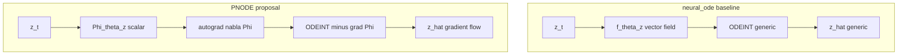
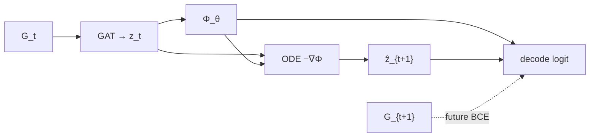

# PNODE 系の論文化パッケージ（実装整合・PNODE 主軸）

査読用に、**主手法を PNODE（勾配流 Neural ODE + 幾何デコーダ）** と置き、**CoPE は同一ポテンシャル \(\Phi\) をリンク尤度にも入れる拡張**として位置づける。実装キーは `run_benchmark_comparison --methods` の `pnode` / `cope`（[ARCHITECTURE.md](ARCHITECTURE.md)、[PAPER_WORKFLOW.md](../PAPER_WORKFLOW.md)）。

---

## Introduction 用の一文（査読向け・Neural ODE との境界）

**日本語（そのまま貼れる）**  
本稿は、年次二部グラフの潜在を **任意ベクトル場の Neural ODE** ではなく、**単一の学習可能スカラー場 \(\Phi_\theta\) の勾配流** \(\frac{dz}{d\tau}=-\alpha\nabla_z\Phi_\theta(z)\) で更新し、**リンク尤度は幾何項のみ**（実装 `pnode`）として将来リンクを予測する枠組みを提案する；これにより時間ダイナミクスに **エネルギー様の構造化帰納バイアス**を与えつつ、実装内の **素の Neural ODE（`neural_ode`）** との差分を一変数で固定できる。

**English (optional one-liner)**  
We forecast future bipartite links by evolving latent node states with a **gradient flow** of a **single learned scalar potential** \(\Phi_\theta\), rather than a **black-box neural ODE vector field**, and decode links with a **pure geometry score** (implementation key `pnode`), yielding a crisp contrast to our **unconstrained latent NODE** baseline (`neural_ode`).

### 図（Neural ODE vs PNODE・査読用の対照）



論文図では左右を並べ、**同一エンコーダ・同一幾何デコーダ**であることをキャプションで固定する。

---

## 1. 主張の固定（本文用）

- **PNODE（実装 `pnode`）**: 潜在は GAT-VAE で符号化し、**可学習スカラー場 \(\Phi_\theta\)** に対する **勾配流** \(\frac{dz}{d\tau}=-\alpha(\theta)\nabla_z\Phi_\theta(z)\) で 1 年先潜在を予測。リンク logit は **幾何項のみ**（距離またはコサイン類似；**デコーダに \(\Phi\) 項は入れない**）。
- **CoPE（実装 `cope`）**: 時間発展は PNODE と同型の **共有 \(\Phi\)** の勾配流。デコーダ logit に **\(w_{\mathrm{pot}}(\Phi(z_i)+\Phi(z_j))\)** を加え、**动力学と尤度で \(\Phi\) を共有**する（ポテンシャル一貫性）。
- **論文で書く差分**: 「ODE-only」と「ODE + デコーダ \(\Phi\) 共有」の対照。新規性を **CoPE 側の \(\Phi\) 共有**に置く場合でも、**ベースラインの中核は PNODE**（時間付き幾何リンクモデル）として記述するとストーリーが一本になる。

---

## 2. 記号表（原稿用）

| 記号 | 意味 |
|------|------|
| \(\mathcal{G}_t\) | 時刻 \(t\) の二部グラフ（左・右パーティションとエッジ \(E_t\)） |
| \(x_t\) | ノード特徴（実装では左の埋め込み上書き可） |
| \(z_{t,i}\) | ノード \(i\) の潜在（VAE の再パラメータ化サンプル） |
| \(\mu_{t,i}, \log\sigma^2_{t,i}\) | エンコーダ出力 |
| \(\Phi_\theta:\mathbb{R}^d\to\mathbb{R}\) | `PotentialNet` のスカラー場 |
| \(\hat z_{t+1}\) | ODE 積分による 1 ステップ先潜在 |
| \(w_{\mathrm{pot}}\) | デコーダの \(\Phi\) 項の係数（`w_pot_init` 等で学習） |
| \(L_{\mathrm{recon}}, L_{\mathrm{KL}}, L_{\mathrm{lat}}, L_{\mathrm{future}}, L_{\mathrm{pot}}, L_{\mathrm{traj}}\) | `compute_loss_standardized` の各成分（[README_COPE.md](../README_COPE.md)） |
| \(y_{T-1}\to y_T\) | 既定の future-link 評価遷移（系列昇順の最終 2 年） |
| ROC-AUC, AP, ECE | `evaluate_val_future_link_metrics`（ECE は sigmoid(logit) 上の等幅ビン期待較正誤差） |

---

## 3. 図 1 枚分（Mermaid → 論文では描き直し）



**PNODE の図**: `logit` から **括弧内の \(\Phi\) 項を省略**したブロック図とする。CoPE は同図に \(\Phi\to\) logit の矢印を足す。

---

## 4. 評価プロトコル・リーク・transductive / inductive（本文にそのまま貼れる段落）

本実験の主指標は、年キーを昇順に並べたとき **最終 2 年 \((y_{T-1},y_T)\)** における **future-link** の **ROC-AUC**、**Average Precision**、および **ECE**（`evaluate_val_future_link_metrics`）。正例は \(y_T\) の観測二部エッジから最大 1500 本をサブサンプルし、負例はその正例に現れるアクティブ左右ノード上で **固定シードの乱数**によりランダム生成するため、**全候補ペア上の指標ではない**ことを明示する。学習中、\(\Phi\) はラベルを直接入力とせず潜在 \(z\) から計算される。オプション **`--holdout-test-year Y`** を用いる場合、学習は \(y<Y\) のグラフのみとし、\(Y\) のエッジは学習損失に含めない；`hist_edges` も学習期間の和集合のみから再構成する。報告は **`final_val_auc` / `final_val_ap` / `final_val_ece`** を **ホールドアウト遷移** \((Y\text{の直前}\to Y)\) と定義する。ホールドアウト無しの既定設定では、評価は学習に用いた同一ノード集合上の **最終 2 年遷移**であり **transductive** に近い；ホールドアウト最終年を学習から外す設定は **テスト年のリンクを学習に使わない**点で **より厳しい汎化プロトコル**として記述できる。詳細チェックリストは [PAPER_WORKFLOW.md](../PAPER_WORKFLOW.md) セクション 2。

---

## 5. 消融（Step5）と実装・CLI の対応表

| ID | 計画の変更 | 実装での再現 |
|----|------------|----------------|
| **A1** | \(w_{\mathrm{pot}}=0\)（デコーダから \(\Phi\) 除去） | `run_benchmark_comparison --methods pnode`（`cope` と同一勾配流・損失枠だが幾何デコーダのみ） |
| **A2** | \(L_{\mathrm{pot}}=0\) | `--potential-weight 0`（`pnode` または `cope`） |
| **A3** | \(L_{\mathrm{traj}}=0\) | `--trajectory-weight 0` |
| **A4** | 時間 ODE を切る（静的予測子） | `--methods static`（他ハイパラは揃えたうえで比較） |
| **A5** | 負例本数の感度 | `--num-neg-recon` / `--num-neg-future`（既定の半分・2 倍など） |

補助損失の一括オフ（再構成+KL 中心）は特許パイプライン向け [`run_cope_effectiveness.py`](../run_cope_effectiveness.py) の `mode=both`（[PAPER_WORKFLOW.md](../PAPER_WORKFLOW.md) セクション 4）。

---

## 6. Supplementary 用・再現コマンド例（リポジトリルート）

パス・年は環境に合わせて置換すること。

**主ベンチ（全手法・AP/ECE 付き JSON）**

```bash
python -m pnode_patent_runner.run_benchmark_comparison \
  --data-domain patent \
  --data notebooks/work/dataset/topic_info3.csv \
  --year-range 2010 2020 \
  --epochs 10 --seed 42 --methods all --cope-link-score distance
```

**ホールドアウト（主表推奨）**

```bash
python -m pnode_patent_runner.run_benchmark_comparison \
  --data-domain patent \
  --data notebooks/work/dataset/topic_info3.csv \
  --year-range 2010 2020 --holdout-test-year 2020 \
  --epochs 10 --seed 42 --methods all --cope-link-score distance
```

**A2**

```bash
python -m pnode_patent_runner.run_benchmark_comparison \
  --data-domain patent --data notebooks/work/dataset/topic_info3.csv \
  --year-range 2010 2020 --epochs 10 --seed 42 --methods cope \
  --cope-link-score distance --potential-weight 0
```

**A3**

```bash
python -m pnode_patent_runner.run_benchmark_comparison \
  --data-domain patent --data notebooks/work/dataset/topic_info3.csv \
  --year-range 2010 2020 --epochs 10 --seed 42 --methods cope \
  --cope-link-score distance --trajectory-weight 0
```

**A5（負例 2 倍の例）**

```bash
python -m pnode_patent_runner.run_benchmark_comparison \
  --data-domain patent --data notebooks/work/dataset/topic_info3.csv \
  --year-range 2010 2020 --epochs 10 --seed 42 --methods all \
  --num-neg-recon 1600 --num-neg-future 800
```

**公平 HPO 後の主表**

```bash
python -m pnode_patent_runner.run_benchmark_comparison \
  --data-domain patent --data notebooks/work/dataset/topic_info3.csv \
  --year-range 2010 2020 --holdout-test-year 2020 \
  --epochs 20 --methods all \
  --optuna-best-json-map pnode_patent_runner/outputs/optuna/optuna_paths_by_method.json
```

---

## 7. 否定結果・事前解析スケジュール（Step6）

| 想定失敗 | 事前・報告で入れる解析 |
|----------|-------------------------|
| CoPE が PNODE / ベースラインに勝てない | ドメインごとに `--cope-link-score distance` と `cosine` を **事前**に比較し、本文は **データごとに 1 設定に固定**；`latent_dim`・`λ_traj` の感度表を Appendix |
| \(w_{\mathrm{pot}}\to 0\) に近い | 学習後のデコーダ係数・`last_epoch_train_breakdown` をログし、**「幾何のみで十分」**と結論できる材料を残す |
| 未来 AUC と再構成のトレードオフ | 同一シード列で **再構成 BCE と `final_val_ap`** を併記し **Pareto** 的に報告 |
| `torch-scatter` 無効など環境差 | Docker（リポジトリ [Dockerfile](../../Dockerfile)）と **シード・ハードウェア**を Supplementary に記載 |

多シード・多ドメインの雛形: [`scripts/paper_benchmark_suite.example.sh`](../scripts/paper_benchmark_suite.example.sh)。

---

## 8. 関連ドキュメント

- [PAPER_WORKFLOW.md](../PAPER_WORKFLOW.md) — 評価・ホールドアウト・HPO・表の書き方
- [README_COPE.md](../README_COPE.md) — 損失・データ CLI
- [ARCHITECTURE.md](ARCHITECTURE.md) — モジュール構造
